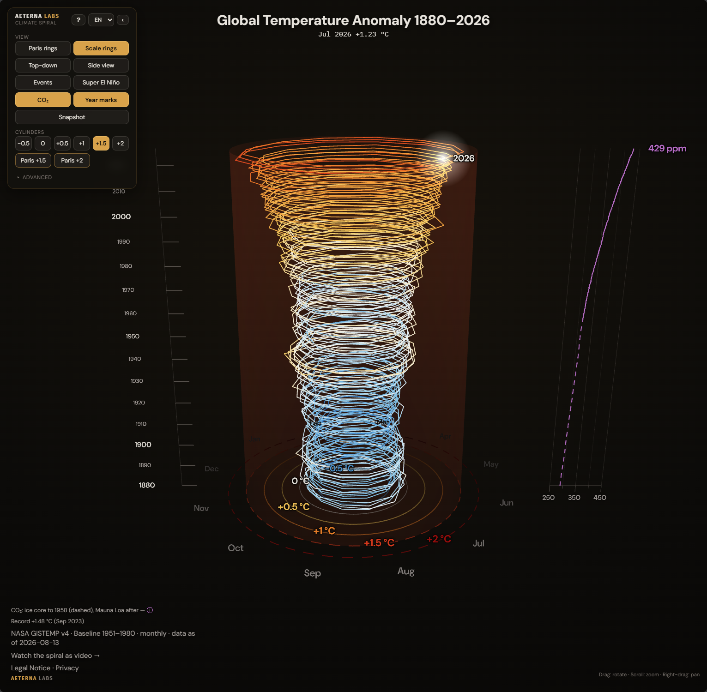

# Klimaspirale

*[English version: README.md](README.md)*

Eine animierte 3D-Klimaspirale, die 146 Jahre globale Erwärmung in einem einzigen Bild zeigt: Aus
einer flachen Spirale wird am Ende ein **Trichter**, der sich zur Gegenwart hin aufweitet, weil
die jüngsten Jahre die wärmsten der Messreihe sind.



## ▶ Live-Demo

**<https://climate.aeternalabs.io>**

Läuft direkt im Browser, ohne Download. Die Spirale ist frei drehbar, die Zeitachse lässt sich
abspielen und durchziehen, dazu gibt es eine CO₂-Kurve und ein Paris-Ziel-Overlay.

---

## Was ist das

Jeder Monat von 1880 bis heute setzt einen kurzen Schritt an die Spirale. Wie weit ein Schritt vom
Mittelpunkt entfernt liegt, hängt von der Temperaturabweichung dieses Monats ab, also davon, wie
weit die globale Temperatur über oder unter einem langjährigen Mittel lag. Warme Monate liegen
weiter außen, kühle weiter innen. Von oben betrachtet ergibt das eine flache Spirale.

Am Ende kippt die Kamera in eine 3D-Perspektive und die Windungen fahren in die Höhe auseinander.
Der Trichter entsteht, weil die jüngsten Anomalien die größten sind, die äußersten Windungen also
zugleich die weitesten.

Die Gestaltung folgt der NASA-Visualisierung [SVS #4975](https://svs.gsfc.nasa.gov/4975) und wird
deterministisch gerendert, gleiche Eingabe ergibt also immer die gleichen Frames. Die Daten
reichen hier bis 2026 statt bis 2021.

Die interaktive Web-Version läuft in **9 Sprachen** (de en fr es pt zh ja ru uk). Im Overlay
„Basiszeitraum & Paris-Ziele“ steht, gegen welches Mittel die Abweichungen gerechnet werden:
Dieses Projekt nutzt die Jahre 1951-1980, den Basiszeitraum des GISTEMP-Datensatzes. Die
Paris-Klimaziele zählen dagegen ab dem vorindustriellen Zeitraum 1850-1900, und 1951-1980 war
bereits rund **+0,19 °C** wärmer als dieser. Deshalb liegen die Paris-Ringe im Bild entsprechend
weiter innen als die gleichnamigen 1,5-/2-°C-Ringe der GISTEMP-Skala.

Die Video-Fassungen werden über [HyperFrames](https://hyperframes.heygen.com) gerendert, das HTML
Frame für Frame in MP4 umsetzt, mit einer [Three.js](https://threejs.org)-Szene. Details zu
Mapping, Datenpipeline und Render-Setup: [docs/ARCHITECTURE.md](docs/ARCHITECTURE.md).

---

## Quickstart

Die interaktive Version braucht keinen Build-Schritt, aber die Ordner `vendor/` und `fonts/`
direkt daneben. Also erst das Repo klonen, nicht nur die einzelne HTML-Datei herunterladen.

```bash
git clone https://github.com/AeternaLabsHQ/climate-spiral.git
```

Dann `klimaspirale_interaktiv.html` im Browser öffnen. Wer nur diese eine Datei herunterlädt
und für sich allein öffnet, bekommt eine schwarze Seite: Die Datei lädt Three.js und ihre
Schriften aus den Ordnern `vendor/` und `fonts/`, die im Repo direkt daneben liegen.

Alternativ den Ordner mit einem beliebigen statischen Server ausliefern und über localhost
öffnen, zum Beispiel:

```bash
python -m http.server
# oder
npx serve
```

Für Entwicklung und Daten-Sync:

```bash
npm test          # Testsuite
npm run sync       # Daten aus data/*.json in alle HTML-Kompositionen synchronisieren
npm run sync:check # nur prüfen, ob Inline-Daten von der Quelle abweichen (exit 1 bei Drift)
```

Zum Rendern der HyperFrames-Videokompositionen (`spiral-*/`) siehe
[docs/ARCHITECTURE.md](docs/ARCHITECTURE.md#rendering-and-reproducing).

---

## Datenquellen & Attribution

| Reihe | Quelle |
|---|---|
| Globale Temperatur | NASA **GISTEMP v4** (`GLB.Ts+dSST`), Basis 1951-1980 |
| CO₂-Konzentration | **Law Dome** Eiskern (bis 1958) + **NOAA GML Mauna Loa** (ab 1958) |

Details, Schema und Update-Ablauf: [docs/ARCHITECTURE.md](docs/ARCHITECTURE.md#data).

---

## Lizenz

- **Code** dieses Repositories: [MIT](LICENSE).
- **Medien** (Videos, Poster-Standbilder, interaktive Darstellung): **CC BY 4.0**. Nutzung ist
  frei, auch kommerziell und in Bearbeitungen, solange die Quelle genannt wird. Details und ein
  Beispielsatz für die korrekte Namensnennung: [LICENSE-media.md](LICENSE-media.md).
- **Dritt-Code** (three.js, GSAP, Fonts) und dessen jeweilige Lizenzen: [THIRD-PARTY.md](THIRD-PARTY.md).

Beiträge sind willkommen, siehe [CONTRIBUTING.md](CONTRIBUTING.md).

---

## Weiterführende Dokumente

- [docs/ARCHITECTURE.md](docs/ARCHITECTURE.md): Projektstruktur, Datenpipeline, visuelles Mapping, Three.js/HyperFrames-Implementierung
- [docs/OPERATIONS.md](docs/OPERATIONS.md): Ablauf bei einem neuen Datenstand
- [docs/](docs/README.md): vollständiger Dokumentationsindex
